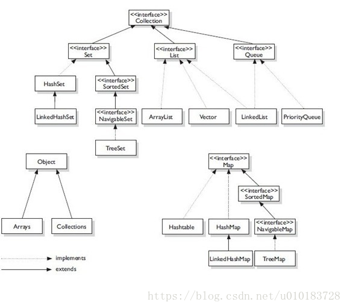

## 重写和重载
重写是子类对父类的允许访问的方法的实现过程进行重新编写, 返回值和形参都不能改变
重载(overloading) 是在一个类里面，方法名字相同，而参数不同。返回类型可以相同也可以不同。

## 线程安全
### Java线程安全的类
* HashTable
    * Properties
* Vector
* StringBuffer

### 线程不安全的类
* HashMap
* ArrayList
* StringBuilder

## 面向对象编程三大特性
* 封装
* 继承
* 多态

## 多态
是同一个接口，使用不同的实例而执行不同操作。
父类引用指向子类对象

把不同的子类对象都当作父类来看，可以屏蔽不同子类对象之间的差异，写出通用的代码，做出通用的编程，以适应需求的不断变化。
### 多态的实现条件
* 继承
* 重写
* 向上转型


### 多态的优点：

1. 消除类型之间的耦合关系
2. 可替换性
3. 可扩充性
4. 接口性
5. 灵活性
6. 简化性

### 多态的体现形式
继承
父类引用指向子类
重写

## 堆和栈区别
堆由程序员分配释放，存放实例对象等内容，分配方式类似于链表

栈由操作系统自动分配释放，用于存放函数的参数值、局部变量等，其操作方式类似于数据结构中的栈


# 设计模式
## 单例模式
### 懒汉式
三种
1. 不加锁，线程不安全
2. 对整个静态方法加锁，线程安全，但效率不高
3. 双重检验，先判断是否存在，若不存在对类对象进行加锁，再判断一次是否存在
### 饿汉式
两种
1. 静态变量
2. 静态代码块

### 静态内部类
线程安全同时效率高，类被装载时并不是立即实例化，而是在需要实例化的时候调用获取实例方法才会完成实例化

### 枚举
解决线程同步，防止反序列化重新创建新的对象

## 工厂模式
意图：定义一个创建对象的接口，让其子类自己决定实例化哪一个工厂类，工厂模式使其创建过程延迟到子类进行。

主要解决：主要解决接口选择的问题。

何时使用：我们明确地计划不同条件下创建不同实例时。

如何解决：让其子类实现工厂接口，返回的也是一个抽象的产品。

关键代码：创建过程在其子类执行。

优点： 1、一个调用者想创建一个对象，只要知道其名称就可以了。 2、扩展性高，如果想增加一个产品，只要扩展一个工厂类就可以。 3、屏蔽产品的具体实现，调用者只关心产品的接口。

缺点：每次增加一个产品时，都需要增加一个具体类和对象实现工厂，使得系统中类的个数成倍增加，在一定程度上增加了系统的复杂度，同时也增加了系统具体类的依赖。这并不是什么好事。

## 抽象工厂模式
意图：提供一个创建一系列相关或相互依赖对象的接口，而无需指定它们具体的类。

主要解决：主要解决接口选择的问题。

何时使用：系统的产品有多于一个的产品族，而系统只消费其中某一族的产品。

如何解决：在一个产品族里面，定义多个产品。

关键代码：在一个工厂里聚合多个同类产品。

将多个工厂交给一个抽象工厂去管理，通过抽象工厂去选择具体的工厂，具体的工厂再选择具体的对象

工厂模式体现了多态
## LinkedList
LinkedList 是采用双向循环列表实现的。

## IoC(控制反转)
首先想说说IoC（Inversion of Control，控制反转）。这是spring的核心，贯穿始终。所谓IoC，对于spring框架来说，就是由spring来负责控制对象的生命周期和对象间的关系。这是什么意思呢，举个简单的例子，我们是如何找女朋友的？常见的情况是，我们到处去看哪里有长得漂亮身材又好的mm，然后打听她们的兴趣爱好、qq号、电话号、ip号、iq号………，想办法认识她们，投其所好送其所要，然后嘿嘿……这个过程是复杂深奥的，我们必须自己设计和面对每个环节。传统的程序开发也是如此，在一个对象中，如果要使用另外的对象，就必须得到它（自己new一个，或者从JNDI中查询一个），使用完之后还要将对象销毁（比如Connection等），对象始终会和其他的接口或类藕合起来。

那么IoC是如何做的呢？有点像通过婚介找女朋友，在我和女朋友之间引入了一个第三者：婚姻介绍所。婚介管理了很多男男女女的资料，我可以向婚介提出一个列表，告诉它我想找个什么样的女朋友，比如长得像李嘉欣，身材像林熙雷，唱歌像周杰伦，速度像卡洛斯，技术像齐达内之类的，然后婚介就会按照我们的要求，提供一个mm，我们只需要去和她谈恋爱、结婚就行了。简单明了，如果婚介给我们的人选不符合要求，我们就会抛出异常。整个过程不再由我自己控制，而是有婚介这样一个类似容器的机构来控制。Spring所倡导的开发方式就是如此，所有的类都会在spring容器中登记，告诉spring你是个什么东西，你需要什么东西，然后spring会在系统运行到适当的时候，把你要的东西主动给你，同时也把你交给其他需要你的东西。所有的类的创建、销毁都由 spring来控制，也就是说控制对象生存周期的不再是引用它的对象，而是spring。对于某个具体的对象而言，以前是它控制其他对象，现在是所有对象都被spring控制，所以这叫控制反转。

## DI(依赖注入)
IoC的一个重点是在系统运行中，动态的向某个对象提供它所需要的其他对象。这一点是通过DI（Dependency Injection，依赖注入）来实现的。比如对象A需要操作数据库，以前我们总是要在A中自己编写代码来获得一个Connection对象，有了 spring我们就只需要告诉spring，A中需要一个Connection，至于这个Connection怎么构造，何时构造，A不需要知道。在系统运行时，spring会在适当的时候制造一个Connection，然后像打针一样，注射到A当中，这样就完成了对各个对象之间关系的控制。A需要依赖 Connection才能正常运行，而这个Connection是由spring注入到A中的，依赖注入的名字就这么来的。那么DI是如何实现的呢？ Java 1.3之后一个重要特征是反射（reflection），它允许程序在运行的时候动态的生成对象、执行对象的方法、改变对象的属性，spring就是通过反射来实现注入的。

理解了IoC和DI的概念后，一切都将变得简单明了，剩下的工作只是在spring的框架中堆积木而已。

## sychronized和lock区别
第一大不足：由于我们没办法设置synchronized关键字在获取锁的时候等待时间，所以synchronized可能会导致线程为了加锁而无限期地处于阻塞状态。
第二大不足：使用synchronized关键字等同于使用了互斥锁，即其他线程都无法获得锁对象的访问权。这种策略对于读多写少的应用而言是很不利的，因为即使多个读者看似可以并发运行，但他们实际上还是串行的，并将最终导致并发性能的下降。。

1）Lock不是Java语言内置的，synchronized是Java语言的关键字，因此是内置特性。Lock是一个类，通过这个类可以实现同步访问；

2）Lock和synchronized有一点非常大的不同，采用synchronized不需要用户去手动释放锁，当synchronized方法或者synchronized代码块执行完之后，系统会自动让线程释放对锁的占用；而Lock则必须要用户去手动释放锁，如果没有主动释放锁，就有可能导致出现死锁现象。

## hashmap底层实现
HashMap计算hash对key的hashcode进行了二次hash，以获得更好的散列值，然后对table数组长度取摸。

## hashmap扩容为什么是2倍不是3倍
index = (n - 1) & hash。在 n 为 2次幂的情况下时，(n - 1) & hash ≈ hash % n

## 红黑树的特征
1. 节点要么是红，要么是黑
2. 根节点是黑
3. 叶子节点是黑的空节点
4. 红色节点的子节点不能是红色节点
5. 根节点到每个叶子节点的路径上经过的黑色节点数量相同
## 为什么使用红黑树

## 什么时候转成红黑树


## HashMap和HashSet有什么关系？用HashMap实现HashSet该怎么做？
HashSet的底层就是HashMap，可以说HashSet就是简化版的HashMap。只要不存value，只存key，HashMap就变成了HashSet
## int 和 Integer区别，为什么有Integer缓冲池？
1. Integer是int的包装类；int是基本数据类型； 
2. Integer变量必须实例化后才能使用；int变量不需要； 
3. Integer实际是对象的引用，指向此new的Integer对象；int是直接存储数据值 ； 
4. Integer的默认值是null；int的默认值是0。

## hashcode有什么作用？equals和hashcode什么关系？
hashCode() 的作用是获取哈希码，也称为散列码；它实际上是返回一个int整数。这个哈希码的作用是确定该对象在哈希表中的索引位置。用于HashMap和HashSet计算存储位置。

equals它的作用也是判断两个对象是否相等，如果对象重写了equals()方法，比较两个对象的内容是否相等；如果没有重写，比较两个对象的地址是否相同，价于“==”。同样的，equals()定义在JDK的Object.java中，这就意味着Java中的任何类都包含有equals()函数。

如果两个对象相等，那么它们的hashCode()值一定相同。这里的相等是指，通过equals()比较两个对象时返回true。

如果两个对象hashCode()相等，它们并不一定相等。因为在散列表中，hashCode()相等，即两个键值对的哈希值相等。然而哈希值相等，并不一定能得出键值对相等，此时就出现所谓的哈希冲突场景。

## HashMap和ConcurrentHashMap区别
Hashtable的synchronized是针对整张Hash表的，即每次锁住整张表让线程独占，ConcurrentHashMap允许多个修改操作并发进行，其关键在于使用了锁分段技术。

锁分段技术：首先将数据分成一段一段的存储，然后给每一段数据配一把锁，当一个线程占用锁访问其中一个段数据的时候，其他段的数据也能被其他线程访问。 

ConcurrentHashMap提供了与Hashtable和SynchronizedMap不同的锁机制。Hashtable中采用的锁机制是一次锁住整个hash表，从而在同一时刻只能由一个线程对其进行操作；而ConcurrentHashMap中则是一次锁住一个桶。

ConcurrentHashMap默认将hash表分为16个桶，诸如get、put、remove等常用操作只锁住当前需要用到的桶。这样，原来只能一个线程进入，现在却能同时有16个写线程执行，并发性能的提升是显而易见的。

## 讲一下wait，notify，notifyAll，notify能具体指定唤醒某一个实例吗？为什么是随机唤醒，底层如何实现？
锁池:假设线程A已经拥有了某个对象(注意:不是类)的锁，而其它的线程想要调用这个对象的某个synchronized方法(或者synchronized块)，由于这些线程在进入对象的synchronized方法之前必须先获得该对象的锁的拥有权，但是该对象的锁目前正被线程A拥有，所以这些线程就进入了该对象的锁池中。

等待池:假设一个线程A调用了某个对象的wait()方法，线程A就会释放该对象的锁，之后进入到了该对象的等待池中

如果线程调用了对象的 wait()方法，那么线程便会处于该对象的等待池中，等待池中的线程不会去竞争该对象的锁。

当有线程调用了对象的 notifyAll()方法（唤醒所有 wait 线程）或 notify()方法（只随机唤醒一个 wait 线程），被唤醒的的线程便会进入该对象的锁池中，锁池中的线程会去竞争该对象锁。也就是说，调用了notify后只要一个线程会由等待池进入锁池，而notifyAll会将该对象等待池内的所有线程移动到锁池中，等待锁竞争

优先级高的线程竞争到对象锁的概率大，假若某线程没有竞争到该对象锁，它还会留在锁池中，唯有线程再次调用 wait()方法，它才会重新回到等待池中。而竞争到对象锁的线程则继续往下执行，直到执行完了 synchronized 代码块，它会释放掉该对象锁，这时锁池中的线程会继续竞争该对象锁。

## Java的值传递
把实参对象引用的地址当做值传递给了形式参数。在方法中，并没有对形参本身进行修改，而是修改的形参持有的地址中存储的内容。对象类型本身不存储具体内容，而是存储一个地址，这个地址指向的空间内存储对象的具体内容。在调用函数时，传递的是对象存储的地址。

## 讲一下Exception和Error
Exception是java程序运行中可预料的异常情况，咱们可以获取到这种异常，并且对这种异常进行业务外的处理。

Error是java程序运行中不可预料的异常情况，这种异常发生以后，会直接导致JVM不可处理或者不可恢复的情况。所以这种异常不可能抓取到，比如OutOfMemoryError、NoClassDefFoundError等。


## 解释IOC，AOP


## SpringMVC处理流程，拦截请求怎么实现？

## springboot的优点，配置文件有什么类型

## AVL特点原理，红黑树特点原理
### AVL
左子树和右子树的高度之差不超过1.通过旋转来保持平衡

### 红黑树

## final、finally、finallize区别

## JVM内存模型
JVM内存空间分为五部分，分别是：方法区、堆、Java虚拟机栈、本地方法栈、程序计数器

### 方法区
主要用来存放类信息、类的静态变量、常量、运行时常量池等，方法区的大小是可以动态扩展的

### 堆
主要存放的是类的实例对象

### Java虚拟机栈
Java虚拟机栈是描述JAVA方法运行过程的内存模型，Java虚拟机栈会为每一个即将执行的方法创建一个叫做“栈帧”的区域，该区域用来存储该方法运行时需要的一些信息，包括：局部变量表、操作数栈、动态链接、方法返回地址等。

### 本地方法栈
本地方法栈结构上和Java虚拟机栈一样，只不过Java虚拟机栈是运行Java方法的区域，而本地方法栈是运行本地方法的内存模型。

### 程序计数器
程序计数器是一个比较小的内存空间，用来记录当前线程正在执行的那一条字节码指令的地址。

## 垃圾回收
java的垃圾回收是自动化的，但是可控性很差，甚至有时会出现内存溢出的情况，
内存溢出也就是jvm分配的内存中对象过多，超出了最大可分配内存的大小。

### System.gc()

System.gc()用于调用垃圾收集器，在调用时，垃圾收集器将运行以回收未使用的内存空间。它将尝试释放被丢弃对象占用的内存。

然而System.gc（）调用附带一个免责声明，无法保证对垃圾收集器的调用。就是执行时不一定会执行垃圾回收。

所以System.gc()并不能说是完美主动进行了垃圾回收。

### jvm怎么确定哪些对象应该进行回收
对象是否会被回收的两个经典算法：引用计数法，和可达性分析算法
#### 引用计数法
简单的来说就是判断对象的引用数量。实现方式：给对象共添加一个引用计数器，每当有引用对他进行引用时，计数器的值就加1，当引用失效，也就是不在执行此对象是，他的计数器的值就减1，若某一个对象的计数器的值为0，那么表示这个对象没有人对他进行引用，也就是意味着是一个失效的垃圾对象，就会被gc进行回收。

但是这种简单的算法在当前的jvm中并没有采用，原因是他并不能解决对象之间循环引用的问题

假设有A和B两个对象之间互相引用，也就是说A对象中的一个属性是B，B中的一个属性时A,这种情况下由于他们的相互引用，从而使得垃圾回收机制无法识别。

#### 可达性分析法（根搜索算法）
因为引用计数法的缺点有引入了可达性分析算法，通过判断对象的引用链是否可达来决定对象是否可以被回收。可达性分析算法是从离散数学中的图论引入的，程序把所有的引用关系看作一张图，通过一系列的名为GC Roots的对象作为起始点，从这些节点开始向下搜索，搜索所走过的路径称为引用链。当一个对象到 GC Roots 没有任何引用链相连（就是从 GC Roots 到这个对象不可达）时，则证明此对象是不可用的。

### 在确定了哪些对象可以被回收之后，jvm会在什么时候进行回收
1. 会在cpu空闲的时候自动进行回收
2. 在堆内存存储满了之后
3. 主动调用System.gc()后尝试进行回收（不一定）

### 找到垃圾后，具体使用的内存回收算法
#### 标记-清除算法
最基础的GC算法，将需要进行回收的对象做标记，之后扫描，有标记的进行回收，这样就产生两个步骤：标记和清除。这个算法效率不高，而且在清理完成后会产生内存碎片，这样，如果有大对象需要连续的内存空间时，还需要进行碎片整理，所以，此算法需要改进。

#### 复制算法
将原有的内存空间分为两块，每次只使用其中一块，在垃圾回收时，将正在使用的内存中的存活对象复制到未使用的内存块中，之后，清除正在使用的内存块中的所有对象，交换两个内存的角色，完成垃圾回收。这种算法的代价是将内存缩小为原来的一半。

#### 标记-压缩算法
和标记-清楚算法前半段一样，只是在标记了不需要进行回收的对象后，将标记过的对象移动到一起，使得内存连续。

#### 分代收集算法
那么现在的重点就是分代收集算法中说的自动根据具体场景进行选择

场景其实指的是针对jvm的哪一个区域，1.7之前jvm把内存分为三个区域:新生代，老生代，永久代。

在新生代中，每次垃圾收集时都发现有大批对象死去，只有少量存活，那就选用复制算法。只需要付出少量存活对象的复制成本就可以完成收集。

老生代中因为对象存活率高、没有额外空间对他进行分配担保，就必须用标记-清除或者标记-整理。
## 注解原理

## Java类加载流程
类加载的过程主要分为三个部分：

* 加载
* 链接
* 初始化

而链接又可以细分为三个小部分：

* 验证
* 准备
* 解析

### 加载
简单来说，加载指的是把class字节码文件从各个来源通过类加载器装载入内存中。

### 验证
主要是为了保证加载进来的字节流符合虚拟机规范，不会造成安全错误。

### 准备
主要是为类变量（注意，不是实例变量）分配内存，并且赋予初值。

### 解析
将常量池内的符号引用替换为直接引用的过程。


### java线程有哪些状态
创建状态（New）、就绪状态（Runnable）、运行状态（Running）、阻塞状态（Blocked）、死亡状态（Dead）。

## notify notifyall区别
notify随机唤醒一个线程。notifyall唤醒全部进程。

## SOLID设计原则
### [S] Single Responsibility Principle (单一功能原则)

单一功能原则 ：单一功能原则 认为对象应该仅具有一种单一功能的概念。

换句话说就是让一个类只做一种类型责任，当这个类需要承担其他类型的责任的时候，就需要分解这个类。

### [O] Open Close Principle （开闭原则）

开闭原则(ocp) 认为“软件体应该是对于扩展开放的，但是对于修改封闭的”的概念。

软件实体应该是可扩展，而不可修改的。也就是说，对扩展是开放的，而对修改是封闭的。这个原则是诸多面向对象编程原则中最抽象、最难理解的一个。
### [L] Liskov Substitution Principle（里氏替换原则）
里氏替换原则 ：里氏替换原则 认为“程序中的对象应该是可以在不改变程序正确性的前提下被它的子类所替换的”的概念。

软件工程大师Robert C. Martin把里氏替换原则最终简化为一句话：“Subtypes must be substitutable for their base types”。也就是，子类必须能够替换成它们的基类。即：子类应该可以替换任何基类能够出现的地方，并且经过替换以后，代码还能正常工作。另外，不应该 在代码中出现if/else之类对子类类型进行判断的条件。里氏替换原则LSP是使代码符合开闭原则的一个重要保证。

### [I] Interface Segregation Principle（接口隔离原则）
接口隔离原则 ：接口隔离原则 认为“多个特定客户端接口要好于一个宽泛用途的接口”的概念。 

### [D] Dependency Inversion Principle（依赖反转原则）
依赖反转原则： 依赖反转原则 认为一个方法应该遵从“依赖于抽象而不是一个实例” 的概念。依赖注入是该原则的一种实现方式。

依赖倒置原则(Dependency Inversion Principle，DIP)规定：代码应当取决于抽象概念，而不是具体实现。
## 连接数据库步骤
原生的jdbc操作数据库流程：
1. 注册驱动程序：Class.forName(“com.mysql.jdbc.Driver”);
2. 使用驱动管理类来获取数据连接对象：conn = DriverManager.getConnection(…);
3. 新建Statement获取数据库操作对象：Statement stmt = conn.createStatement();
4. 定义操作的SQL语句
5. 执行SQL：stmt.executeQuery(sql);
6. 处理结果集：ResultSet
7. 关闭对象，回收数据库资源（关闭结果集–>关闭数据库操作对象–>关闭连接）

## Final
final关键字用法

修饰类
当用final去修饰一个类的时候，表示这个类不能被继承。
注意：
a. 被final修饰的类，final类中的成员变量可以根据自己的实际需要设计为fianl。
b. final类中的成员方法都会被隐式的指定为final方法。
说明：
在自己设计一个类的时候，要想好这个类将来是否会被继承，如果可以被继承，则该类不能使用fianl修饰，在这里呢，一般来说工具类我们往往都会设计成为一个fianl类。在JDK中，被设计为final类的有String、System等。
代码：

2. 修饰方法

被final修饰的方法不能被重写。

注意：

a. 一个类的private方法会隐式的被指定为final方法。

b. 如果父类中有final修饰的方法，那么子类不能去重写。

3. 修饰成员变量

注意：

a. 必须初始化值。

b. 被fianl修饰的成员变量赋值，有两种方式：1、直接赋值 2、全部在构造方法中赋初值。

c. 如果修饰的成员变量是基本类型，则表示这个变量的值不能改变。

d. 如果修饰的成员变量是一个引用类型，则是说这个引用的地址的值不能修改，但是这个引用所指向的对象里面的内容还是可以改变的。

## 拆箱装箱
装箱就是自动将基本数据类型转换为包装器类型；拆箱就是自动将包装器类型转换为基本数据类型。

## Java作用域
1. public：public表明该数据成员、成员函数是对所有用户开放的，所有用户都可以直接进行调用，在程序的任何其它地方访问。

2. protected：子类和同个包内的类可以访问

3. default（默认）：同一包中的类可以访问，声明时没有加修饰符，认为是friendly。

4. private：private表示私有，私有的意思就是除了class自己之外，任何人都不可以直接使用，私有财产神圣不可侵犯嘛，即便是子女，朋友，都不可以使用。和public相反，加上这个修饰的属性和方法，只允许在自己本身这个类里访问，程序的任何其它地方都不能访问 

## 抽象类和接口
* 抽象类要被子类继承，接口要被类实现。

* 接口只能定义抽象方法不能实现方法(Java 8 开始接口方法可以有默认实现），抽象类既可以定义抽象方法，也可以实现方法

* 一个类实现接口的话要实现接口的所有方法，而抽象类不一定。

* 接口里定义的变量只能是公共的静态的常量，即public final类型，必须在声明时初始化，抽象类中不一定

* 一个类可以实现多个接口，但最多只能实现一个抽象类

* 接口强调的是功能，是一种行为的规范；抽象类强调的是所属关系，是一种模板设计。

## 为什么要用迭代器？
迭代器的好处是它是一个接口，这样你只用用接口约定的方法调用就可以迭代，以后如果被迭代的对象可以改变类型，如果考虑以后可能改变类型用迭代器会灵活点
Iterator模式是用于遍历集合类的标准访问方法。它可以把访问逻辑从不同类型的集合类中抽象出来，从而避免向客户端暴露集合的内部结构。遍历容器中的每个对象而不用考虑容器中对象的个数，而且保护数据不显示的表现出来。

迭代器统一了对容器的访问方式。迭代器是一个对象，它的工作是遍历并选择序列中的对象，而客户端程序员不必知道或关心该序列底层的结构。

## Java容器详解
Collection

* List
    * LinkedList
    * Vector
    线程安全
    * ArrayList
    线程不安全
* Map
    * TreeMap
    * HashMap
    线程不安全
    * Hashtable
    线程不安全
* Set
    * TreeSet
    * HashSet
* Queue
    * LinkedList
    * PriorityQueue

## final finally finalize
final: 常量声明。 finally: 处理异常。 finalize: 帮助进行垃圾回收。

接口里声明的变量默认是final的。final类无法继承，也就是没有子类。这么做是出于基础类型的安全考虑，比如String和Integer。这样也使得编译器进行一些优化，更容易保证线程的安全性。final方法无法重写。final变量的值不能改变。finalize()方法在一个对象被销毁和回收前会被调用。finally,通常用于异常处理，不管有没有异常被抛出都会执行到。比如，关闭连接通常放到finally块中完成。

## 栈的应用
1. 递归运算存储每一层结果并返回上一层
2. 匹配括号
3. 计算后缀表达式

## Java中实现多线程的两种方式

1.  继承Thread类
```java
public class ThreadTest {

    public static void main(String[] args){
        new MyThread().start();
        new MyThread().start();
        new MyThread().start();
        new MyThread().start();
    }
    
    //也可以把类写在外边
    public static class MyThread extends Thread{
        private int tickets=100;
        public void run() {
            while(tickets>0){
                System.out.println(this.getName()+"卖出第【"+tickets--+"】张火车票");
            }
        }
    }
}
```

2. 实现Runnable接口
```java
/**
 * 使用Runnable接口模拟4个售票窗口共同卖100张火车票的程序
 */
public class RunnableTest {

    public static void main(String[] args) {
        Runnable runnable=new MyThread();
        new Thread(runnable).start();
        new Thread(runnable).start();
        new Thread(runnable).start();
        new Thread(runnable).start();
    }
    
    public static class MyThread implements Runnable{
        private int tickets=100;
        public void run() {
            while(tickets>0){
                System.out.println(Thread.currentThread().getName()+"卖出第【"+tickets--+"】张火车票");
            }
        }
    }
}
```

3.  两种方式的比较

实际中往往采用实现Runnable接口，一方面因为java只支持单继承，继承了Thread类就无法再继续继承其它类，而且Runnable接口只有一个run方法；另一方面通过结果可以看出实现Runnable接口才是真正的多线程

### start和run方法的区别

1. start：

用 start方法来启动线程，真正实现了多线程运行，这时无需等待run方法体代码执行完毕而直接继续执行下面的代码。通过调用Thread类的 start()方法来启动一个线程，这时此线程处于就绪（可运行）状态，并没有运行，一旦得到cpu时间片，就开始执行run()方法，这里方法 run()称为线程体，它包含了要执行的这个线程的内容，Run方法运行结束，此线程随即终止。

2. run：

run() 方法只是类的一个普通方法而已，如果直接调用Run方法，程序中依然只有主线程这一个线程，其程序执行路径还是只有一条，还是要顺序执行，还是要等待 run方法体执行完毕后才可继续执行下面的代码，这样就没有达到写线程的目的。总结：调用start方法方可启动线程，而run方法只是thread的一 个普通方法调用，还是在主线程里执行。这两个方法应该都比较熟悉，把需要并行处理的代码放在run()方法中，start()方法启动线程将自动调用 run()方法，这是由jvm的内存机制规定的。并且run()方法必须是public访问权限，返回值类型为void.。

## Java标识符
Java 中标识符是为方法、变量或其他用户定义项所定义的名称。标识符可以有一个或多个字符。在 Java 语言中，标识符的构成规则如下：

标识符由数字（0~9）和字母（A~Z 和 a~z）、美元符号（$）、下划线（_）以及 Unicode 字符集中符号大于 0xC0 的所有符号组合构成（各符号之间没有空格）

标识符的第一个符号为字母、下划线和美元符号，后面可以是任何字母、数字、美元符号或下划线（第一个符号不能是数字）。

## Java关键字
Java 语言目前定义了 51 个关键字，这些关键字不能作为变量名、类名和方法名来使用。以下对这些关键字进行了分类。
* 数据类型：boolean、int、long、short、byte、float、double、char、class、interface。
* 流程控制：if、else、do、while、for、switch、case、default、break、continue、return、try、catch、finally。
* 修饰符：public、protected、private、final、void、static、strict、abstract、transient、synchronized、volatile、native。
* 动作：package、import、throw、throws、extends、implements、this、supper、instanceof、new。
* 保留字：true、false、null、goto、const。

## 字符串比较
先比较长度，长度不同直接干掉。

长度相同再去比较每个字符，一旦有一个不一样的也干掉。

全部比较完成才相等。

## 字符串的定义？
编程语言中表示文本的数据类型

## Volatile
它可以在多线程并发的情况下保证变量的“可见性”，什么是可见性？就是在一个线程的工作内存中修改了该变量的值，该变量的值立即能回显到主内存中，从而保证所有的线程看到这个变量的值是一致的

## ThreadLocal
用来提供线程内的局部变量，这样每个线程都自己管理自己的局部变量，别的线程操作的数据不会对我产生影响，互不影响