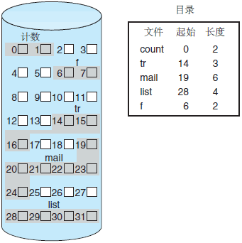
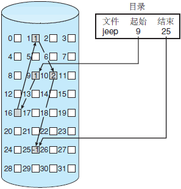
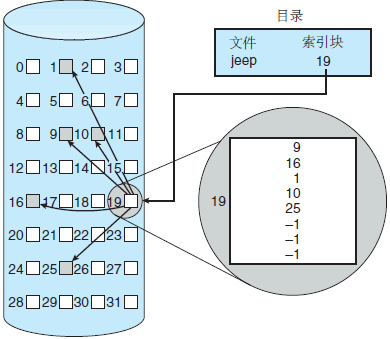

## 线程和进程的区别
1. 进程：是执行中一段程序，是资源分配的基本单位
线程：单个进程中执行中每个任务就是一个线程。线程是进程中执行运算的最小单位。

同一个进程下的线程共享资源、地址空间、代码段和数据段。每个线程拥有自己的栈内存用来存储本地数据。
2. 一个线程只能属于一个进程，但是一个进程可以拥有多个线程。多线程处理就是允许一个进程中在同一时刻执行多个任务。

3. 线程是一种轻量级的进程，与进程相比，线程给操作系统带来侧创建、维护、和管理的负担要轻，意味着线程的代价或开销比较小。

4. 线程没有地址空间，线程包含在进程的地址空间中。线程上下文只包含一个堆栈、一个寄存器、一个优先权，线程文本包含在他的进程 的文本片段中，进程拥有的所有资源都属于线程。所有的线程共享进程的内存和资源。 同一进程中的多个线程共享代码段(代码和常量)，数据段(全局变量和静态变量)，扩展段(堆存储)。但是每个线程拥有自己的栈段， 寄存器的内容，栈段又叫运行时段，用来存放所有局部变量和临时变量。

5. 父和子进程使用进程间通信机制，同一进程的线程通过读取和写入数据到进程变量来通信。

6. 进程内的任何线程都被看做是同位体，且处于相同的级别。不管是哪个线程创建了哪一个线程，进程内的任何线程都可以销毁、挂起、恢复和更改其它线程的优先权。线程也要对进程施加控制，进程中任何线程都可以通过销毁主线程来销毁进程，销毁主线程将导致该进程的销毁，对主线程的修改可能影响所有的线程。

## 进程之间通信
消息队列
管道
信号量
信号
套接字
共享内存

## 线程之间如何进行通讯
锁机制：包括互斥锁、条件变量、读写锁
信号量机制(Semaphore)
信号机制

## 死锁的必要条件
* 互斥访问
* 占有和等待
* 非抢占
* 循环等待

## 处理死锁的方法
### 预防
1. 打破互斥
2. 打破Hold and wait
    * 在运行前把所有所需资源拿来（不容易）
    * 请求资源时把占有的资源都释放（很好）
3. 打破循环等待。有序地申请资源

### 避免
判断请求在未来是否出现死锁
银行家算法

## 虚拟内存
先将部分程序导入内存，执行完成后导入下一部分程序，给我们的感觉是内存变大了，实际上物理内存的大小并未发生变化。
### 虚拟内存的作用
1. 使用虚拟地址可以更加高效的使用物理内存。在计算机系统中物理内存是有限的，对于一般的计算机来说，物理内存一般为4G或者8G. 对于现代多任务的通用系统来说这显然是不够的
2. 使用虚拟地址可以使内存的管理更加便捷。在程序编译的时候就会生成虚拟地址，对于不同的机器或者对于同一台机器的不同时间，该虚拟地址可以对应不同的物理页
3. 为了安全性的考虑。在使用虚拟地址的时候，暴露给程序员永远都是虚拟地址，而具体的物理地址在哪里，这个只有系统才了解。这样就提高了系统的封装性。

### 页表
记录虚拟内存和物理内存的映射关系，一般采用多级页表

### 地址翻译
地址翻译指的是DRAM缓存命中时，由虚拟地址找到物理地址的过程。

## 磁盘块的分配

### 连续分配
\<起始块位置，文件长度\>

- 产生外部碎片
- 简单、快速
- 有浪费
- 文件大小不能改变

### 链接分配

- 离散的
- 链表结构
- 没有外部碎片
- 不能直接访问
- 指针会占据额外的空间
#### 隐式链接
可靠性差，只要有一个磁盘块坏了，后面的都无法访问
#### 显式链接
例子
File-Allocation Table **FAT**

改善了随机访问时间
提高了可靠性

### 索引分配

每个文件都有索引块
* 需要索引表
* 随机访问
* 没有外部碎片，但小文件有内部碎片
* 浪费空间

索引块指针的开销通常大于链接分配的指针开销。考虑一下常见情况，即一个文件只有一块或两块。采用链接分配，每块只浪费一个指针的空间。采用索引分配，即使只有一个或两个指针是非空的，也必须分配一个完整的索引块。

这一点提出了一个问题：索引块应为多大？每个文件必须有一个索引块，因此需要索引块尽可能小。然而，如果索引块太小，它不能为大的文件存储足够多的指针。因此，必须采取一种机制，以处理这个问题。此目的的机制包括：
#### 链接方案
一个索引块通常为一个磁盘块。因此，它本身能直接读写。为了支持大的文件，可以将多个索引块链接起来。例如，一个索引块可以包括一个含有文件名的头部和一组头 100 个磁盘块的地址。下一个地址（索引块的最后一个字）为 null（对于小文件），或者另一个索引块的指针（对于大文件）。
#### 多级索引
链接表示的一种变种是，通过第一级索引块指向一组第二级的索引块，它又指向文件块。当访问一块时，操作系统通过第一级索引查找第二级索引块，再采 用这个块查找所需的数据块。这种做法可以持续到第三级或第四级，具体取决于最大文件大小。对于 4096 字节的块，可以在索引块中存入 1024 个 4 字节的指针。两级索引支持 1 048 576 个数据块和 4GB 的最大文件。
#### 组合方案
用于基于 UNIX 的文件系统，将索引块的前几个（如 15）指针存在文件的 inode 中。这些指针的前 12 个指向直接块；即它们包含存储文件数据的块的地址。因此，小的文件（不超过 12 块）不需要单独的索引块。如果块大小为 4KB，则不超过 48KB 的数据可以直接访问。接下来的 3 个指针指向间接块。第一个指向一级间接块。一级间接块为索引块，它包含的不是数据，而是真正包含数据的块的地址。第二个指向二级间接块，它包含了一个块的地址，而这个块内的地址指向了一些块，这些块中又包含了指向真实数据块的指针。最后一个指针为三级间接块指针。图 5 显示了一个 UNIX 的 inode。

## 安卓四大组件
### Activity
展示型组件，用于向用户直接地展示一个界面，并且可以接受用户的输入信息从而进行交互
### Service
计算型组件，用于在后台执行一系列的计算任务
### Broadcast Receiver
消息型组件，用于在不同的组件乃至不同的应用之间进行消息传递
### Content Provider
数据共享型组件，用于向其他组件乃至其他App共享数据